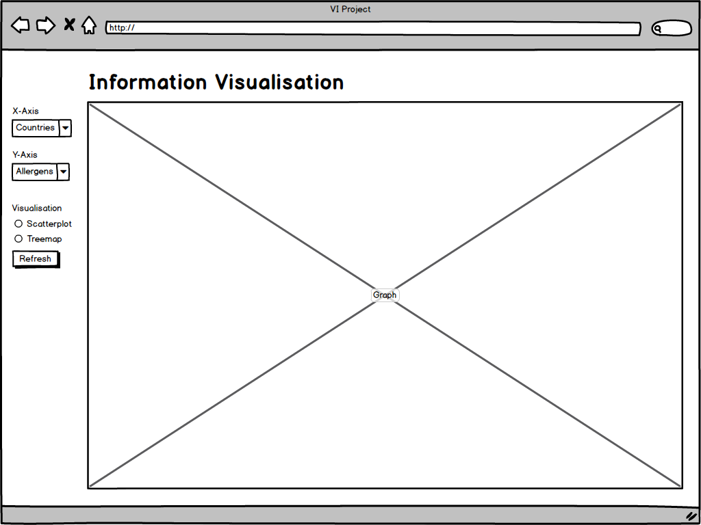

# VI
HES-SO: Visualisation de l'information

This is a team project required by the VI module in the context of the master at HES-SO

**==> Link for the current deployment:** [https://rocha-n.github.io/VI/](https://rocha-n.github.io/VI/)

## Index
[Main idea and message](#main-idea-and-message)  
[Usable dimensions for visualisation](#usable-dimensions-for-visualisation)
[Available Data](#available-data)  
[Visualisation](#visualisation)  
[Repository Structure](#repository-structure)  

## Main idea and message
Nowadays, we have such a enourmous offer on alimentation products that it becomes quite easy to become submerged, and get tricked by  perfectly calibrated marketing appeal in choosing (mostly) the wrong ones.  

No wonder nutrition problems had arisen everywhere and the diet market is booming at the moment.  

The main idea behind this project is to be able to show the user information about __quality__ of food, in order to help to make an educated choice among the __quantity__ proposed.   

To do so, we use a __nutrition index__. It's a value between A and E (better to worst, respectively) that is calculated to take account of the nutritional properties as well as the components of the product. The better the index, the better the food you're eating!

## Available data
The data presented to the user is a subset of the [Open Food Facts](#https://world.openfoodfacts.org) database.  
We suppressed all records that were considered invalid or incomplete.  
Then we removed all the remaining records that had not a value for the country, the make or the ranking.  
As the data where initially really sparse, we reduced considerably the data, in order to be able to have 100% appliable records only.  
Finally, we transformed the database format, from CSV to JSON.  

After all the database alterations, the file went from 1.8Gb to 29.2Mb!  

## Usable dimensions for visualisation
There are three main dimensions that are left to user choice: Country, make, and ranking.

## Visualisation

The user will be presented with this interface:  
<!--le menu à gauche répond au pattern hamburger -->

The main part of the screen is occupied by a Treemap visualisation.  
It will display one of the three main dimensions. Each time the user selects one tile of the Treemap, the visualisation will change, as it will take the user's choice as a filter. It will then display another dimension to which the previously created filter has been applied. As there are three dimensions, the user will be able to go down three levels.  

On the left portion of the screen, a menu, obeing to the so-called _hamburger pattern_, will allow the user to set manually  the three dimensions with a drop-down menu. It will also be able to select if the values displayed are finite quantities or percent. Also, there is a `Back` button at the top of the menu to enable the user to go back one level in its filters.

On the top of the screen, there is a banner indicating where the visualised data comes from, so the user can visit the source website and, if wanted, to collaborate on populating the database.

## Repository structure
- data folder
  - contains the datasets used for the application.  
  We will start with a reduced one, and then use the full data file for release
- mockups folder
  - contains, well... mockups! Fair enough?
